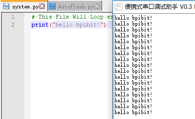

# **BpiBit MicroPython**

## **开发指南**

### 1. 编程环境介绍

&emsp;&emsp;由宇宙第一帅气的我来为大家介绍一下 Bpibit 的 Python 运行环境。

#### 标准编程环境

&emsp;&emsp;第一次使用固件的时候， BpiBit 系统会默认生成两个文件，分别为 boot.py 与 system.py 。 boot.py 仅在上电前运行一次，而 system.py 将会反复循环运行。

&emsp;&emsp;system.py 文件默认内容为 
```python 
# This file is executed on every boot (including wake-boot from deepsleep)
#import esp
#esp.osdebug(None)
#import webrepl
#webrepl.start()
```
&emsp;&emsp;而 boot.py 会有一行注释 
``` python
# This file is executed on every boot (including wake-boot from deepsleep)
```
&emsp;&emsp;意思就是该文件会在上电时执行一次。

#### 如何为 BpiBit 编写 Python 程序运行？

&emsp;&emsp;比如说在 system.py 写入如下代码：

```python
print("hello bpibit!")
```

&emsp;&emsp;则串口将会反复输出以下信息。

- 

&emsp;&emsp;这就是运行Python的第一步，完成了。

#### 更好用的编程环境

&emsp;&emsp;虽然前面已经可以编写Python并执行了，但这样并不是我真正想要的。

&emsp;&emsp;因此可将Python环境分为开发环境和生产环境。

- #### 生产环境

&emsp;&emsp;在生产环境下，自己编写的Py代码不会被系统的其他服务打断，也就是在标准编程环境中将 system.py 写死循环即可，同时WebDav服务将不会被执行，也就无法在Python运行时修改Python代码了。

- #### 开发环境

	&emsp;&emsp;在开发环境下，当然是希望编写代码后保存，即时运行程序，最好还可以边写边运行Python程序，以及程序的随时停止和运行，所以提供了本目录下的三个文件，分别为boot.py、system.py、index.py。

	&emsp;&emsp;boot.py 会提供给系统一个线程检查 index.py 的文件变动的情况从而执行 index.py 代码，所以仅需在 index.py 文件里直接写代码运行即可。
		
	代码在[CodeReloadToExectue](CodeReloadToExectue)

&emsp;&emsp;除了以上功能，对此还提供了可以控制Py代码的执行或停止的功能，在system.py文件中，通过检测某一个按键（例如：A键）来决定是否执行程序，默认设计成按住A键就执行代码，松开停止执行，返回到代码处继续修改，修改后更新，再按住A键继续执行，当然你也可以反过来，只需要将代码中的`0 == RUN.value()`修改成`1 == RUN.value()`就变成，按住时可以修改Python代码，松开继续执行。

&emsp;&emsp;代码在[system.py](CodeReloadToExectue/system.py)

&emsp;&emsp;可以看到，当按住 A键 时，执行`print`，松开后停止输出。

#### 相关案例与学习资料

&emsp;&emsp;以下相关教程与资源可以帮助你在Bpibit上了解和学习Python。

1. 软件相关应用

   - 如何用Python验算加密算法
   - 如何用Python爬取网络数据
   - 如何用Python自动登陆网站
   
2. 硬件相关应用

   - 播放音乐和变化呼吸灯代码
   - 如何使得两灯交错闪缩
   - 如何使用超声波测距
   - 如何获取外界温度
   - 如何控制开关当生物靠近时

3. 官方文档资料

   1. [USE MICROPYTHON ONLINE](http://www.micropython.org/unicorn)
   2. [MicroPython](http://docs.micropython.org/en/latest/esp8266/)
   3. [StudyPython](http://www.runoob.com/python/python-intro.html)
   4. [Esp32中文文档](https://docs.singtown.com/micropython/zh/latest/esp32/index.html)
