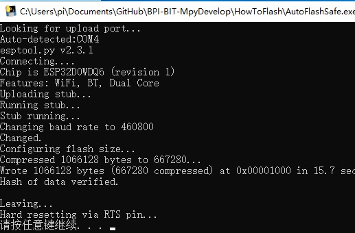

# **BpiBit MicroPython**

## **烧写与调试**

### 如何烧写？

&emsp;&emsp;首先将您的 BitBpi 板子接入电脑，例如：Windows 会提示您有驱动需要安装，不用担心，直接点击自动下载安装即可，如果您不知道如何安装驱动，请到此处[如何安装CH340串口驱动](https://jingyan.baidu.com/article/c33e3f48dce50aea15cbb596.html)或下载相关驱动安装工具，例如：[Driver Talent（驱动人生）](https://www.drivethelife.com/)，可以自动帮您解决驱动问题，而在 Windows 10 当中也会自动检测并帮您下载安装完成。

&emsp;&emsp;最后请确保驱动已经成功安装且板子已经正确连入电脑后，您可以继续阅读以下内容。

#### 1. 在 Windows 下运行此目录下提供的程序

- 运行 AutoFlashSafe(或Fast).exe 程序会自动查找最新插入的串口并将同一目录下的`fimware.bin`文件烧写至芯片当中。

- AutoErase.exe 程序可以将固件擦除，如果此前有其他固件存在，或遇到了不可解决的问题，均可通过该修复工具重置板子后烧写固件。

- 上述程序经由相关 Python 脚本与`Pyinstller X86`模块打包而成。

#### 2. 在 Linux 中使用 Shell 执行以下代码烧写

``` Shell
sudo esptool.py --chip esp32 --port COM3 --baud 1152000 write_flash -z --flash_mode dio --flash_freq 40m 0x1000 firmware.bin
```

- 在此之前需用户安装 python2.7 与安装其依赖项 esptool ，例如`pip install esptool`。

- esptool.py 是 ESP 芯片系列的烧写脚本工具。

- `--chip esp32` 指esp32芯片。

- `--port COM3` 指烧写端口，COM3是Windows环境下的串口命名，在Linux下则是/dev/ttyUSB0。

- `--baud 1152000`，如果出现烧写错误，可以下调到460800，这会导致烧写的速度下降。

- `firmware.bin`，指烧写文件的位置，如果没有路径则默认是同一目录下。

- 其他保持不变，如果有疑问向我们可以提出。

#### 3. 在 Python 语言解释器环境当中执行烧写

- [AutoFlash.py](https://github.com/junhuanchen/BPI-BIT-MpyDevelop/blob/master/HowToFlash/AutoFlash.py) 分别为Fast和Safe，即为快速烧写和安全烧写，除了烧写速度以外没有区别，可在Py代码中查阅得知。

- [AutoErase.py](https://github.com/junhuanchen/BPI-BIT-MpyDevelop/blob/master/HowToFlash/AutoErase.py) 是指擦除当前硬件的固件，当遇到无法解决的问题时候，可以尝试擦除。

# 烧写之后？

- 烧写之后，如果烧写成功会如下图，否则会闪退或出现红色警告内容。

- 

- 烧写成功以后请到 [趣味编程等案例](https://github.com/junhuanchen/BPI-BIT-MpyDevelop/tree/master/Code) 下获取对应的 Python 开发示例代码。

- 或回到原点继续学习如何调试固件 [使用说明书](https://github.com/junhuanchen/BPI-BIT-MpyDevelop) 。

# 出现问题？

- 当不知道怎么解决的时候，请直接提交问题给我们进行解决。

- 如果没人提供解决方案，您也可以自己使用修复工具后重新烧写固件。

- 修复工具执行成功之后结果的如下图。

- 

# 疑难解答

- Q：点击烧写程序闪退，出现红色警告，烧写固件失败。

- A：大多数原因是因为您的串口驱动存在问题，解决这个问题后可以再次尝试，如果出现了烧写错误，有可能是您的电脑正在使用多个串口导致识别错误的问题，请确保板子是最新插入的，否则不能自动识别为 BitBpi 板子并烧写，如果确定有这个问题也出现了烧写失败的情况，请更换至 Safe 版本的烧写程序，若仍然失败，请更换至其他烧写的连接线，此时依旧烧写失败的话，请将板子寄给我们，我们将免费为您维修或更换。
